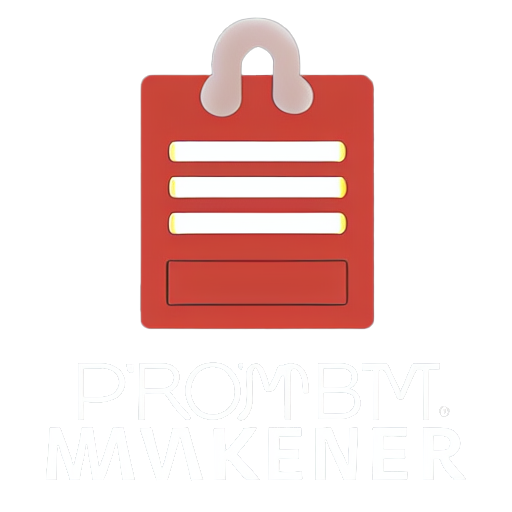

<!-- Improved compatibility of back to top link: See: https://github.com/othneildrew/Best-README-Template/pull/73 -->

<!--
*** Thanks for checking out the Best-README-Template. If you have a suggestion
*** that would make this better, please fork the repo and create a pull request
*** or simply open an issue with the tag "enhancement".
*** Don't forget to give the project a star!
*** Thanks again! Now go create something AMAZING! :D
-->

<!-- PROJECT LOGO -->
 

  

  <h3 align="center">Prompt Maker</h3>

  

    A prompt maker utility for stable diffusion!
     
     
    <a href="https://prompt-maker.github.io">View Demo</a>
    ·
    <a href="https://github.com/prompt-maker/prompt-maker.github.io/issues">Report Bug</a>
    ·
    <a href="https://github.com/prompt-maker/prompt-maker.github.io/issues">Request Feature</a>
  

<!-- ABOUT THE PROJECT -->
## About The Project

[![Product Name Screen Shot][product-screenshot]](https://prompt-maker.github.io)

this website is used as a tool for generating prompts for stable diffusion

### Built With

* [![Bootstrap][Bootstrap.com]][Bootstrap-url]

(<a href="#readme-top">back to top</a>)

<!-- USAGE EXAMPLES -->
## Usage

Use this website in combination with the local version stable diffusion locally on your computer,

_For more information about stable diffusion and installation, please refer to the [Documentation](https://github.com/CompVis/stable-diffusion) or [Documentation](https://github.com/lstein/stable-diffusionn)_

(<a href="#readme-top">back to top</a>)

<!-- MARKDOWN LINKS & IMAGES -->
<!-- https://www.markdownguide.org/basic-syntax/#reference-style-links -->
[issues-url]: https://github.com/prompt-maker/prompt-maker.github.io/issues
[product-screenshot]: images/screenshot.jpg
[Svelte.dev]: https://img.shields.io/badge/Svelte-4A4A55?style=for-the-badge&logo=svelte&logoColor=FF3E00
[Svelte-url]: https://svelte.dev/
[Laravel.com]: https://img.shields.io/badge/Laravel-FF2D20?style=for-the-badge&logo=laravel&logoColor=white
[Laravel-url]: https://laravel.com
[Bootstrap.com]: https://img.shields.io/badge/Bootstrap-563D7C?style=for-the-badge&logo=bootstrap&logoColor=white
[Bootstrap-url]: https://getbootstrap.com